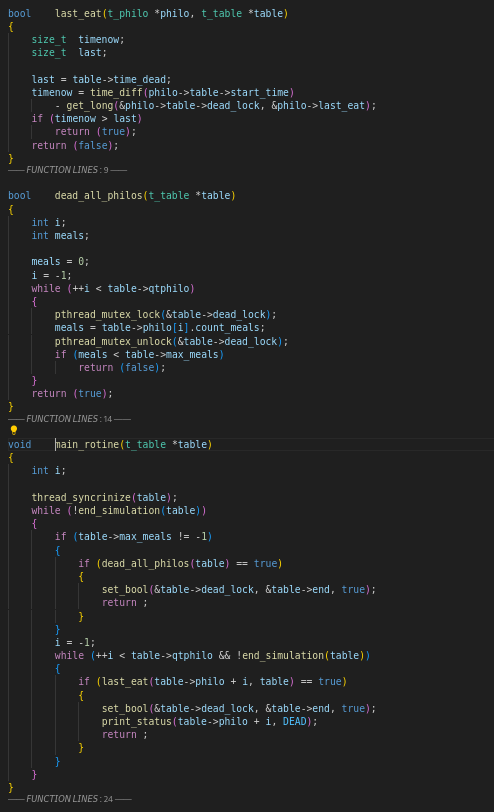
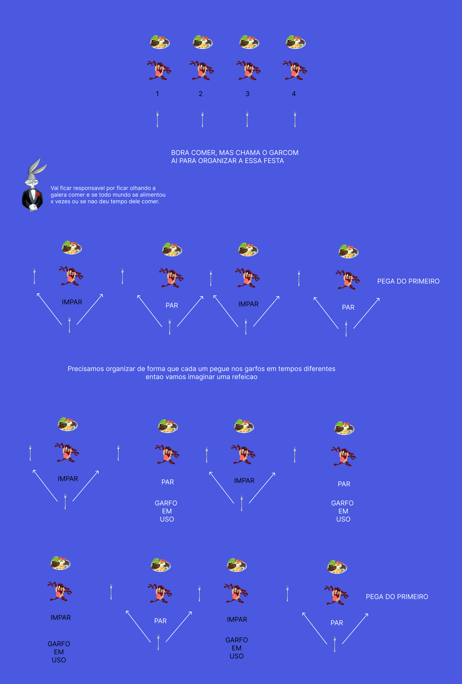

# Philosophers

## Visão Geral

Trabalhar com threads é algo interessante, afinal é uma forma de IPC (Inter-Process Communication). Para começarmos, precisamos entender o problema, e é sempre bom começarmos com a análise do que o usuário vai nos fornecer e o que vamos fazer com essa informação.

Na chamada do nosso programa, o usuário tem que passar a quantidade de threads, o tempo de morte do filósofo, o tempo que ele vai comer, e o tempo que ele vai dormir. Ele pode passar também quantas vezes o filósofo vai comer, se quiser. Ou seja:

Ex: `./philo [NF] [TD] [TA] [TD] [QA]`, sendo o último opcional.

## Problema

Com threads, utilizamos a mesma variável em diferentes threads, realizando consultas e alterações. Para evitar condições de corrida (race conditions), precisamos de uma forma bem sincronizada de trabalhar. Para isso, usamos mutexes, que bloqueiam a variável para que uma thread faça o que precisa e, após a alteração, libere-a para que outra thread enxergue a variável com o valor atualizado. Pense nisso como travas que obrigam você a esperar a alteração ser feita antes de continuar. O objetivo dos filósofos é que todos comam, sendo que é necessário 2 garfos, e cada um só tem um. Precisamos criar uma forma em que todos possam se alimentar de acordo com o tempo passado.

Threads podem parecer rápidas em comparação com processos, mas devem ser muito bem organizadas e otimizadas para que tudo ocorra bem. No nosso problema, não podemos avisar aos filósofos que um morreu, então criamos outra thread para monitorar nossa refeição. Ela tem como principal objetivo verificar a última vez que os filósofos comeram e se todos já comeram a quantidade escolhida pelo usuário.

### Monitor

A solução é simples utilizando a ideia de ímpares e pares. Os ímpares pegam o garfo à sua esquerda e depois pegam o garfo do colega à frente. Utilizamos um `usleep` para que os pares comecem depois, assim evitamos condições de corrida, ou seja, evitamos que tentem pegar os garfos ao mesmo tempo. Isso é importante; precisamos sincronizá-los para evitar esse tipo de situação.

Para nosso monitor, temos duas funções que verificam a última vez que alguém comeu ou se todos já estão satisfeitos. Temos alguns spinlocks utilizados para começar toda a rotina após a criação de todos. Depois disso, trabalhamos travando e destravando as variáveis e verificando, de forma que não ocorra qualquer tipo de condição de corrida ou de corrida de dados.

